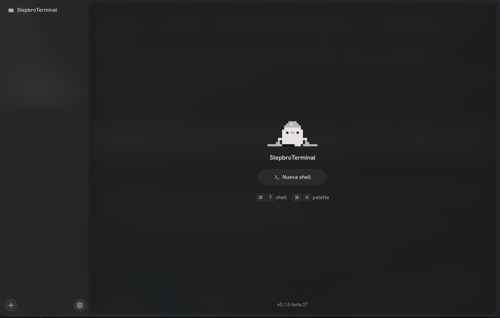

# stepbro terminal (beta)

A terminal built for running coding agents like Claude Code, Codex and OpenCode, with sessions that keep running when you close the window.

## Latest: 0.1.0-beta.27

Settings that read at a glance, with Topito up front.

- **Windows**: [StepbroTerminal-0.1.0-beta.27-win-x64.exe](https://github.com/kevin9038440334/StepbroTerminal-releases/releases/download/v0.1.0-beta.27/StepbroTerminal-0.1.0-beta.27-win-x64.exe)
- **macOS (Apple Silicon)**: [StepbroTerminal-0.1.0-beta.27-mac-arm64.dmg](https://github.com/kevin9038440334/StepbroTerminal-releases/releases/download/v0.1.0-beta.27/StepbroTerminal-0.1.0-beta.27-mac-arm64.dmg)
- **macOS (Intel)**: [StepbroTerminal-0.1.0-beta.27-mac-x64.dmg](https://github.com/kevin9038440334/StepbroTerminal-releases/releases/download/v0.1.0-beta.27/StepbroTerminal-0.1.0-beta.27-mac-x64.dmg)
- **Linux**: [AppImage](https://github.com/kevin9038440334/StepbroTerminal-releases/releases/download/v0.1.0-beta.27/StepbroTerminal-0.1.0-beta.27-linux-x86_64.AppImage) or [.deb](https://github.com/kevin9038440334/StepbroTerminal-releases/releases/download/v0.1.0-beta.27/StepbroTerminal-0.1.0-beta.27-linux-amd64.deb)

What changed in each version is on the [Releases](https://github.com/kevin9038440334/StepbroTerminal-releases/releases) page. Once installed, the app updates itself.

The builds are not signed yet, so Windows and macOS warn the first time you open them. On Windows click "More info" and then "Run anyway"; on macOS right-click the app and choose "Open".

It is early and things will change. If something breaks, open an issue here and tell me what you were doing.
